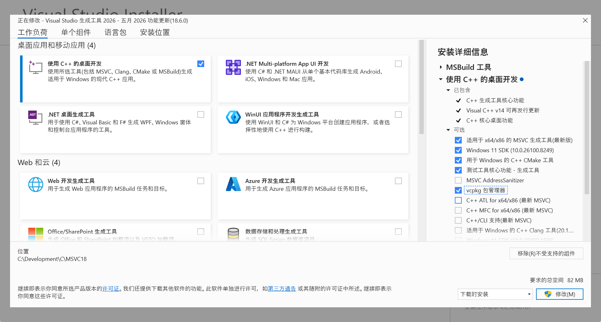
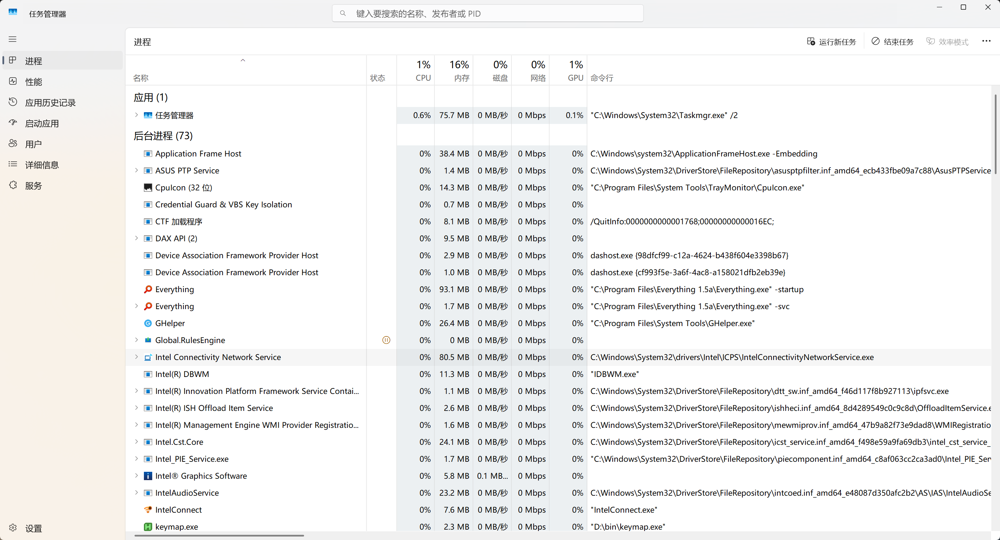

# 深度精简 Windows11 系统

Windows11 一直是我的主力机，随着近几次更新，感觉它越来越臃肿了：经常有莫名其妙的进程在大幅占用 CPU、内存，
完全空载的情况下 Windows 系统本身能吃掉我接近 15GB 内存。作为轻度洁癖，不能忍受微软这种喂粪行为，于是开始激进地精简我的电脑系统。

## TL;DR 

* 删掉不用的系统软件：[Raphire/Win11Debloat](https://github.com/Raphire/Win11Debloat)
* 删除所有 AI 功能（第三方总能找到替代品）：[zoicware/RemoveWindowsAI](https://github.com/zoicware/RemoveWindowsAI)
* 删除 Defender，大部分情况无需杀毒软件，用防火墙与浏览器安全插件即可。[ionuttbara/windows-defender-remover](https://github.com/ionuttbara/windows-defender-remover)
* 删除 Windows 索引，换 Everything。这个步骤较多，见下文。
* 删除 Edge 和 WebView2，换成 Chrome。

## 删删删

### 删除多余系统组件

比较出名的几个工具：
* [Raphire/Win11Debloat](https://github.com/Raphire/Win11Debloat)
* [ChrisTitusTech/winutil](https://github.com/ChrisTitusTech/winutil)
* [Geek](https://geekuninstaller.com/download) 

几个重点：
* 删除无用的自带应用
* 关掉广告、咨询、天气、定位等
* 用 Geek 删掉各类流氓软件并清理注册表

### 删除所有 AI 功能

作为中国大陆用户，除了 Windows Photo 里的 AI 功能，其他功能对我而言完全是负面更新。但是，微软虽然在 UI 上禁用了这些组件，在服务、以及后台却仍在跑这些进程：
* Recall: 后台服务名叫 **WorloadsSessionHost**，这个我真没招了，起名还以为是系统进程，占了 2GB 内存零作用。
* AI Fabric Service: 后台的服务名叫 **WSAIFabricSvc**，某天我发现它莫名占用了大量 CPU。
* Click to Do 
* Copilot, AI Host: 大陆用户默认不会运行，但是会占磁盘。

工具：[zoicware/RemoveWindowsAI](https://github.com/zoicware/RemoveWindowsAI) 

### 删除 Windows Defender

删掉 Windows Defender，个人觉得完全不必安装杀毒软件，因为这种软件都会频繁扫盘和拦截系统操作，吃性能。但是保留 WIndows Firewall，以及浏览器的安全过滤功能。可疑文件不要随便打开，去情报库搜一下哈希，能防大部分病毒。

工具：[ionuttbara/windows-defender-remover](https://github.com/ionuttbara/windows-defender-remover)

### 删除 Start Menu Experience（可选）

Windows11 的开始菜单会占用 0.5% CPU 和 60MB 左右内存，因为它是 UWP 应用，可以理解为是基于 WebView 的小网页前端。没有用，还全是广告，建议直接删掉。应用快捷方式直接放桌面，或者搜索一下打开即可。

工具：
* [anymor/1Click-StartMenu](https://github.com/amymor/1Click-StartMenu) 删掉 Windows 开始菜单
* [powertoys/command-palette](https://learn.microsoft.com/en-us/windows/powertoys/command-palette/overview) 用这个作为类似 Mac Spotlight 的应用打开器。

开始菜单是一个受系统保护的 UWP 应用，因此 [anymor/1Click-StartMenu](https://github.com/amymor/1Click-StartMenu) 脚本的实际功能是：修改 exe 属主为管理员群组，然后用一个空文件替代掉原本的 exe 文件。开始菜单（Start Menu）的文件位置大概是 `C:\Windows\SystemApps\Microsoft.Windows.StartMenuExperienceHost_cw5n1h2txyewy\`

### 删除 Windows Search 

Windows 搜索虽然一直在优化，但还是非常难用。首先是占用大量内存和磁盘存索引，其次经常占用大量 CPU，最后搜索体验很差。个人使用中，大部分场景都是搜索文件名，不需要文件内容。因此 Everything 是完美平替，唯一缺点是界面不现代，但有一些第三方美化。

删除步骤：
* 禁用 Windows Search 服务。
* 移除硬盘索引：（右键磁盘 > 属性 > 取消勾选 “在此磁盘建立索引”）
* 禁用 Web SearchHost: [windows11-scripts/DisableSearchHost.bat](https://github.com/shoober420/windows11-scripts/blob/main/DisableSearchHost.bat)

**上文三个应用（开始、继续、搜索）的 UI 界面都是系统级 UWP 应用，禁用服务也不会停止后台进程，必须处理 exe 文件。即使删除后，每次 Windows 更新后也会被微软修复，不想折腾可以先不管。**
* CrossDeviceResume
* StartMenuExperienceHost
* WindowsSearchHost

似乎 Win11 为搜索 SearchHost 和 CrossDeviceResume 提供了一个注册表禁用方式:

```powershell
reg add "HKLM\SOFTWARE\Policies\Microsoft\Windows\Windows Search" /v DisableSearch /t REG_DWORD /d 1 /f

taskkill /F /IM SearchHost.exe

reg add "HKCU\Software\Microsoft\Windows\CurrentVersion\CrossDeviceResume\Configuration" /v IsResumeAllowed /t REG_DWORD /d 0 /f

taskkill /F /IM CrossDeviceResume.exe
```

### 删除大而臃肿的软件

* 用 Stirling-PDF 替换为 Adobe Acrobat DC 
* 用 VSCode 替换 VisualStudio
* 用 7-Zip 替换 WinRAR 
* 删掉一些硬件厂商自带的电脑管家和 OEM 系统服务，比如华硕 MyAsus 可以替换为 G-Helper。
* 用 mpv、potplayer 替代掉各类播放器
* 用 Standalone 软件替代依赖 WebView2 Runtime 的应用。此类应用经常宣称自己很“轻量”，但会偷偷在后台拉起很重的浏览器进程，为什么我不直接用浏览器的 Web 应用？

### 删除无用开发环境

由于很多语言的原生系统并不是 Windows，因此在 Windows 上的开发环境很臃肿，有些还会污染系统环境。推荐将部分语言或库的开发环境迁移到 WSL 上，隔离性更好，搭建快方便删库重开，并且性能几乎没有损失。
* C/C++ Visual Studio（VC Build Tools）：建议 IDE 删掉，命令行环境保留（见下），搭配 VCPkg 食用。
* C/C++ LLVM ：完全迁移到 WSL。在 Windows 上不仅需要 LLVM，还需要大量 MSVC 依赖。
* C/C++ GNU：完全迁移到 WSL 原生环境，不要使用 MinGW 等兼容环境。
* Zig、Rust、Texlive(Latex)：建议完全迁移到 WSL
* JS、Python：在 Windows 上保留一个 NodeJs、CPython，用于轻量执行。其他工程化环境迁移到 WSL，实测 Linux 的文件系统在安装大量依赖时，比 Windows NTFS 快非常多。
* Go：比较原生和轻量，可以保留在 Windows 上。

## 改改改

### 清理右键菜单

首先，将右键菜单从 Win11 切换为 Win10，可以用 [explorer patcher](https://github.com/valinet/explorerpatcher) 来做。Win11 的右键菜单实在是太卡了，强烈建议干掉。

Win10 右键菜单的问题是，垃圾软件经常往里塞东西，导致很臃肿。这里推荐用 [ContextMenuManager](https://github.com/BluePointLilac/ContextMenuManager/tree/master) 来管理。

对于一些流氓软件，用 ContextMenuManager 干不掉的菜单项，让 AI 帮忙写注册表文件 `.reg` 来修改。

### Shell 环境

推荐在 Windows 下使用 [PowerShell7](https://github.com/powershell/powershell) + [Windows Terminal](https://github.com/microsoft/terminal) 组合。**用 CMD 会变得不幸**。

不推荐使用 MSYS2 等兼容 GNU 环境，需要具体命令可以用原生 Windows 替代品：

* [file](https://github.com/nscaife/file-windows)
* [coreutils](https://github.com/uutils/coreutils) 包含各类 GNU 常见工具
* 各类 Rust 重写工具：rg, bat, fd, dust

### C++ 开发环境

C++ 只推荐使用 [Build Tools for Visual Studio (MSVC)](https://visualstudio.microsoft.com/downloads/)，这是 Visual Studio 的后端环境，也是 Windows 原生的 C++ 后端。下载安装器后，挑选自己需要的组件安装即可，不要全部安装，共计 2.5GB 左右。



* 不要使用 Unix 兼容层如 Msys2、Cygwin 或 MinGW，否则环境很臃肿。
* 不要使用基于 LLVM 后端的语言，比如 Rust、Zig、Haskell 等，空间浪费很严重。这种语言强烈建议 WSL
* 使用微软自带的 ReFS 虚拟硬盘功能，来优化 NTFS 读取小文件缓慢的问题。事实上 WSL 速度快的原因，也得益于其使用 VHDX 绕过了 Windows 文件系统。  
* 使用 Ninja 来替代 MSVC 内置的 VS Generator，避免项目生成文件过度臃肿。
* 最后，Git for Windows 也会自带一套 mingw64 环境，建议换成 [MinGit](https://gitforwindows.org/mingit.html)。

另外，MSVC 自带了一套 Shell 环境，里面有各种开发工具：

```powershell
pwsh.exe  -NoExit  -ExecutionPolicy ByPass -Command & 'C:/Program Files/Microsoft Visual Studio/18/Common7/Tools/Launch-VsDevShell.ps1' -Arch amd64 -HostArch amd64
```

### 调用 Win32 API 

未完待续……
* Vive Tools
* AutoHotkey v2

## 成果

机器配置：Asus VivoBook14, 32GB, 1T, Intel 258V CPU. 

在重度使用场景中：开启 Chrome 多个网页、VSCode、WSL 虚拟机（接近 3GB）、Obsidian 时，系统总计 13GB 左右运行内存。离电性能也很流畅，非常满意。

在系统空载状态下，系统总共有 5GB 运行内存。手动排查，已经没有能轻易删除的系统进程，总体达到目标。



