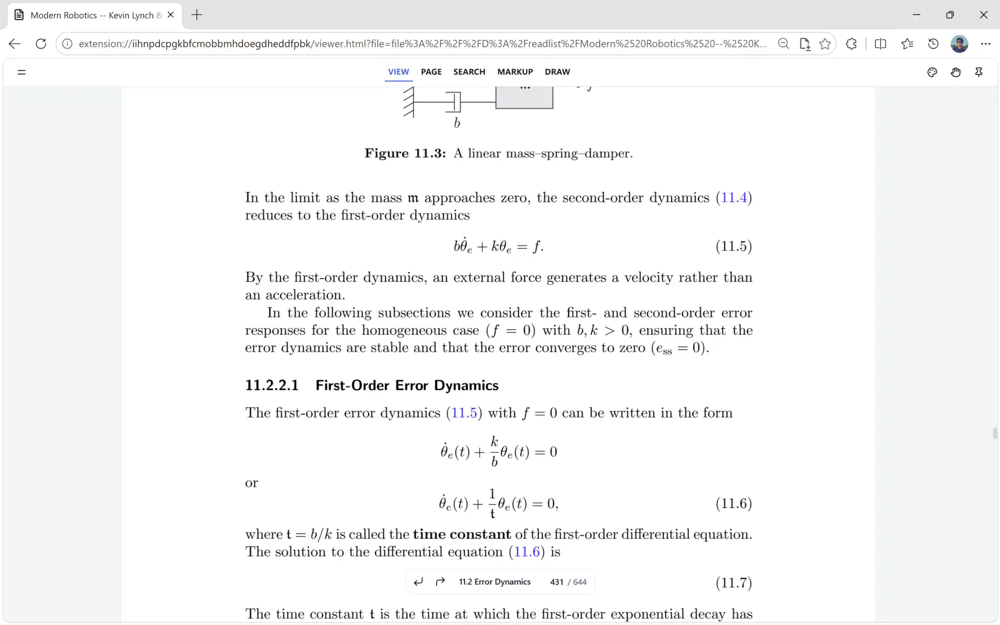
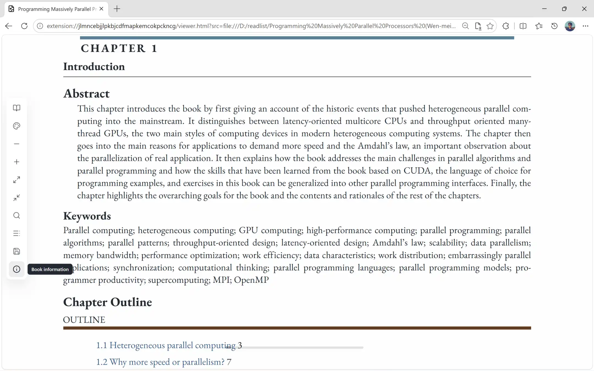
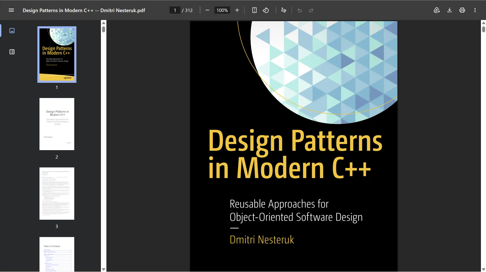
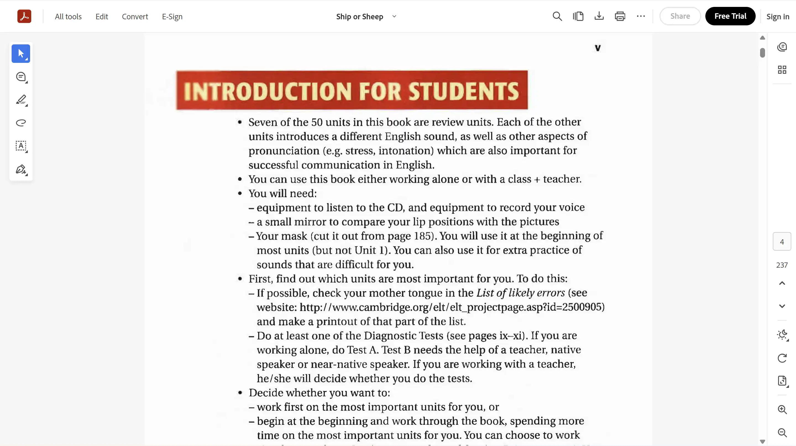
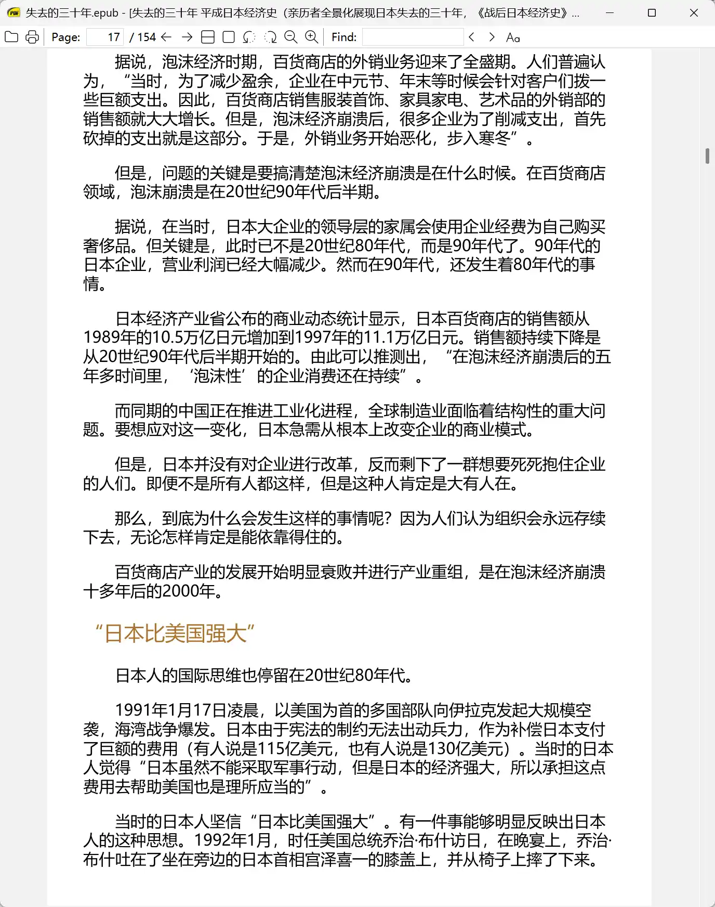
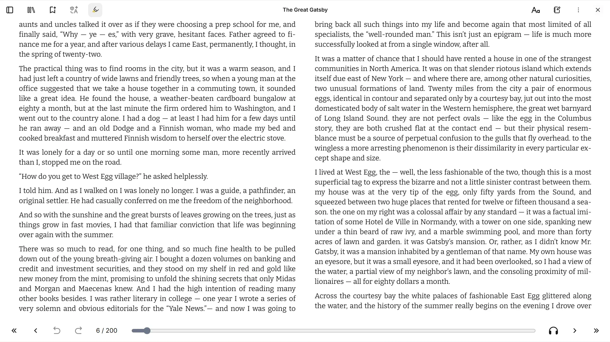

# 给自己做一个漂亮的 EPUB、PDF 阅读器

我总苦于找不到好用的 PDF、EPUB 阅读器。
* Adobe Acrobat 功能很全，界面现代。但不免费，也不轻量。我就看看书，用不到大多数功能。
* Stirling PDF 类似 Acrobat， 不过相对免费。也不轻量。
* Sumatra PDF 很快很轻量，但是丑。
* Readest 很美观，开源，但是正在迅速变得臃肿（很多无用功能）

**我的工作流已经深入嵌入到浏览器中了，浏览器的历史、书签我都频繁使用，还是希望直接用浏览器浏览 PDF 和电子书**。

## pdf.ts

基于 [embedPDF](https://github.com/embedpdf/embed-pdf-viewer) 的浏览器插件。直接拦截 `file://*.pdf`  或 `https://*.pdf` URL，重定向到本插件的页面进行浏览。
* 支持 BMP 高速渲染，同时减少内存消耗。对标 MS-Edge PDF 的性能和空间效率。
* 美观、极简、最小化干扰的UI界面，专注阅读，同时支持标注、评论。

**详细信息和代码开源在 [jay-waves/pdf.ts](https://github.com/jay-waves/pdf.ts)**

## epub.ts

基于 [foliate-js](https://github.com/johnfactotum/foliate-js) 的 Chrome 浏览器插件，拦截 `file://*.epub` 和 `https://*.epub`，重定向到插件页面打开阅读。
* 深入适配和美化各种 epub 样式，多主题，可定制。
* 极简、最小化干扰的阅读界面，同时也支持高亮、标注、翻译。
* 不依赖浏览器存储，高亮等编辑信息直接写入原文件。

**详细信息和代码开源在 [jay-waves/epub.ts](https://github.com/jay-waves/epub.ts)**

## 竞品对比

### ChromePDF

Google 的审美虽然风格统一，但真不好看呀…… 上面的工具栏刘海那么宽。

### Adobe Arobat

承认它功能强大，但是大部分 PDF 编辑功能似乎在日常阅读时都用不到。

### SumatraPDF for EPUB

Win7 的画风。确实轻量，确实极客。

### Readest for EPUB: 

个人认为还是很美观的，就是近期更新总是塞不合理的功能。而且呢，Web 端不能直接拦截 `file://` URL，必须手动导入文件，再进行阅读。

## 跨平台化

Web 应用运行在浏览器的受控沙箱，行为受浏览器控制和安全审查。因此，Web 应用走向本地化（Windows、Linux Apps），最难做的是扩展对本地系统的访问边界。Web 应用难以获取文件系统的权限，难以做进程控制，更难做系统的集成（文件关联、自启动等）。

以浏览器 File System Access API 为例，要获取对文件的读取权限，必须要弹出文件选择窗，让用户选择并点击允许。要获取对文件的写入权限，Chromium 系浏览器需要弹窗，让用户选择原文件并点击允许，后续写入会覆盖原文件；Safari/WebKit 或 Firefox 浏览器则仍不支持获取本地文件的可写句柄，只能下载（固定的下载目录）。

也就是说，不光是访问权限受限制，不同浏览器间的接口和提供的能力也不同。跨端维护非常麻烦。

常见的解决办法有三种：
1. 套浏览器壳（Electron、Tauri），应用内置一个浏览器环境（或 WebView），获取大部分系统级权限。
2. 远程化。用户数据上传到远程服务器，或复制到浏览器沙盒内的本地存储。但不存储在用户自己的目录。
3. 本地代理。在用户本地运行一个有权限的后台进程，Web 应用通过 localhost API 向它发起请求，有它代理完成操作。

下面介绍我在跨端时的设计选择：

### Chrome 插件

用户打开 `*.pdf, *.epub` 文件时，浏览器打开 `file://` URI，插件监听这个动作，然后劫持并重定向到插件的浏览界面。

用户修改文件后，需要写入时，弹出弹窗，让用户选择写入位置。当用户选择原文件位置时，就是原地覆盖写入。

### Web 应用

打开 `jay-waves.cn/epub.ts` 后，展示 Welcome 界面，用户选择或拖拽文件来打开浏览界面。因为是用户的主动动作，
Chrome 系浏览器允许同时获取读/写权限。

用户修改文件后，需要写入时，Safari 或 Firefox 浏览器会直接触发下载，Chrome 浏览器则会直接写回原文件。

### Windows 桌面应用

用 Go 为桌面端写了一个小 Launcher，可以作为（不会自动作为）一个后台服务运行。以 `pdf.ts.exe` 为例，`exe` 内置嵌入了所有的 Web 应用资源，并注册自身为 pdf 文件打开方式。

点击一个 pdf 后，web 应用资源被临时解压，跳转到浏览器内打开。后续用户修改文件后，需要写入时，Web 应用直接通过本地网络通信，和正在监听的 `pdf.ts.exe` 通信，由它代理进行文件编辑写入。
