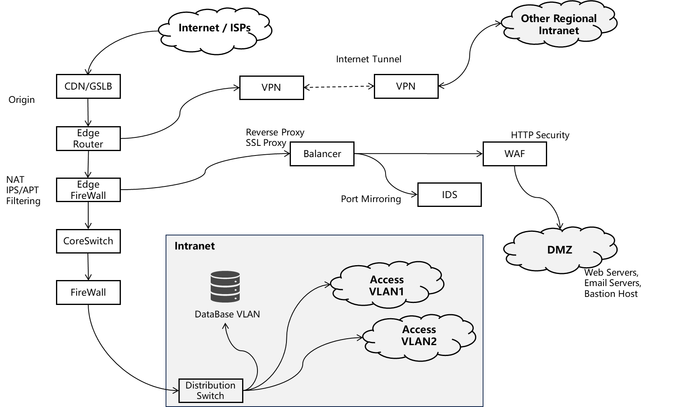
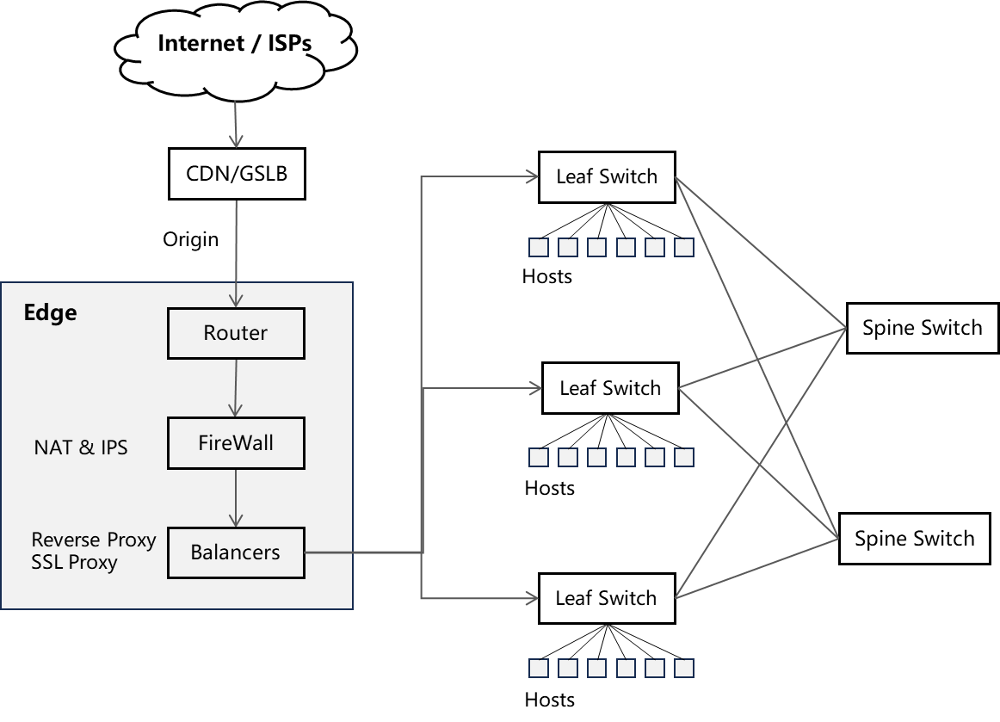

# Network Topology

## Access-Aggregation-Core

  

Firewalls, load balancers, and core switches should all have redundancy; at least two units are required. Access-Aggr-Core design prioritizes **north-sourth traffic** (client-to-server flows). 

Internet <---> FW <---> DMZ <---> FW <---> Intranet

## Leaf-Spine 

Leaf-spine architecture is primarily designed to optimize **east–west traffic** within data center environments.  leaf-spine assumes most communication occurs between servers. Every leaf switch connects to all spine switches, creating multiple equal-cost paths between any two endpoints. 

For more details, see [til/net/data-center](https://github.com/jay-waves/til/blob/main/net/data-center.md)

