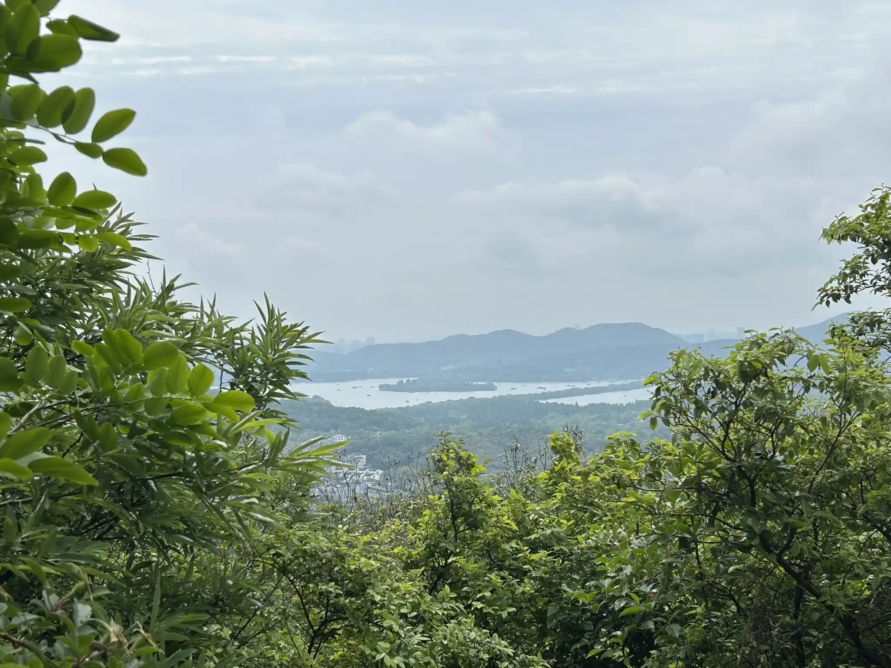
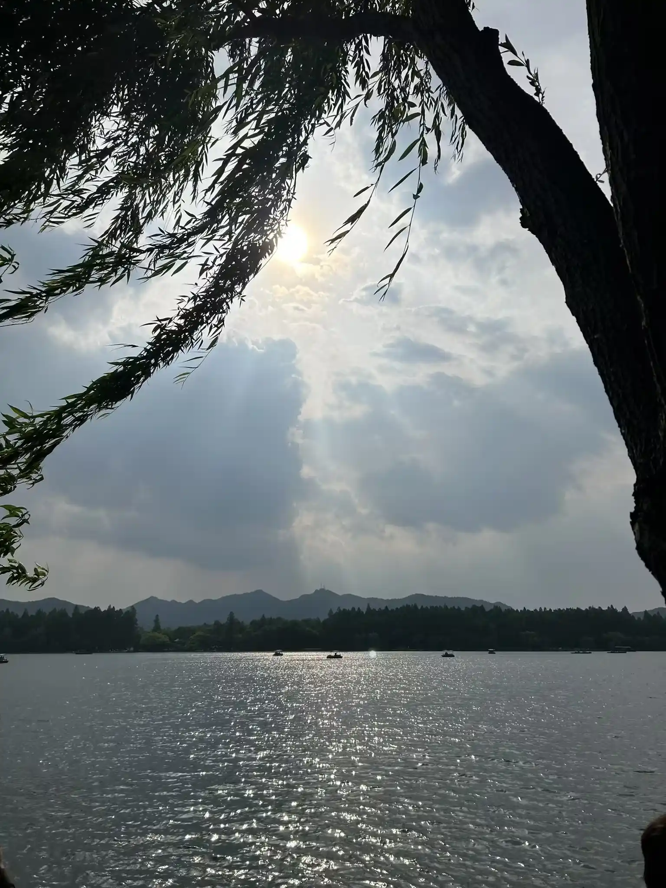
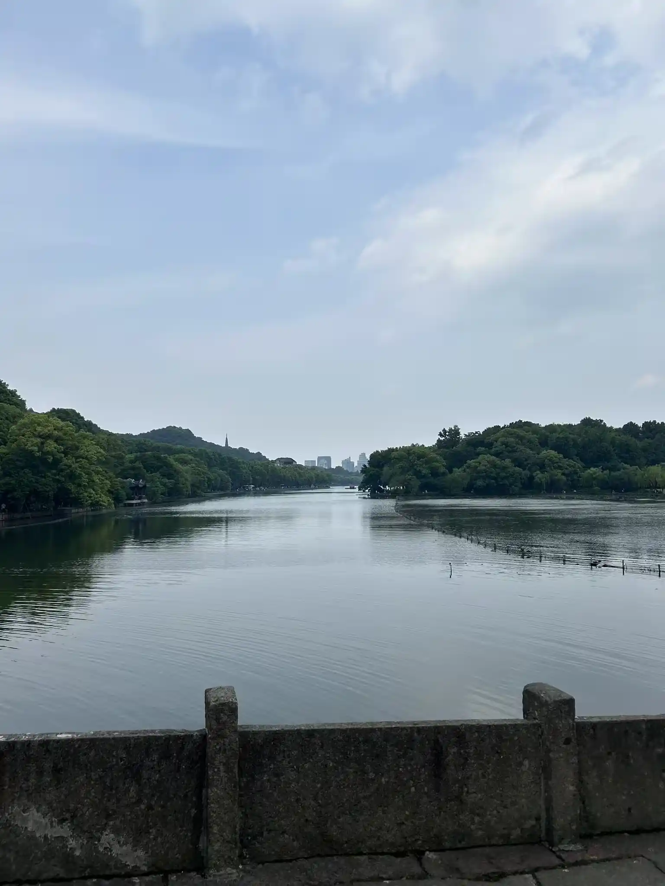
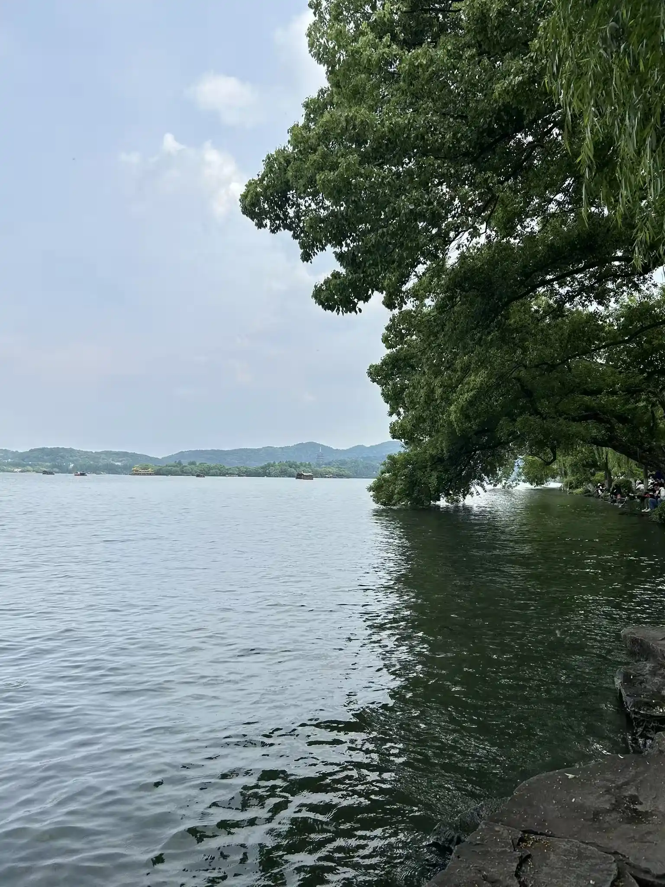
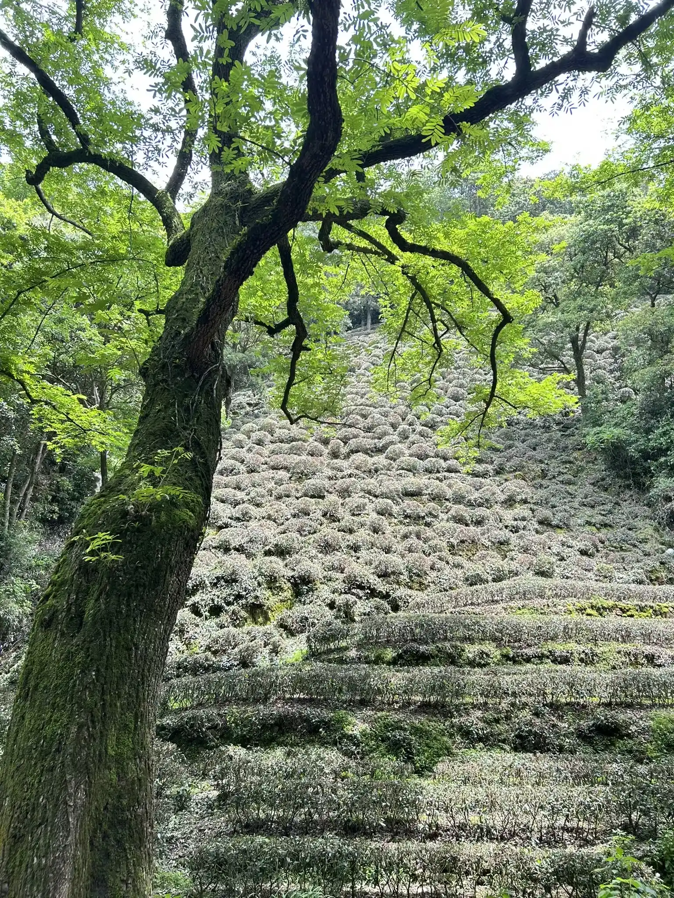
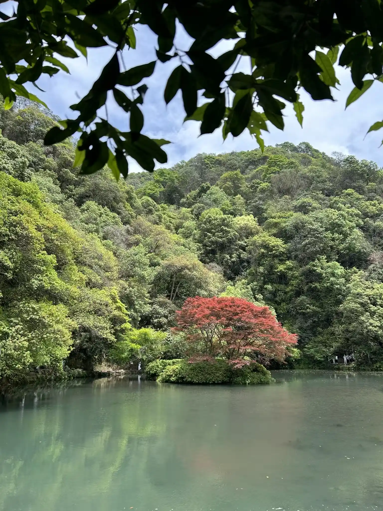
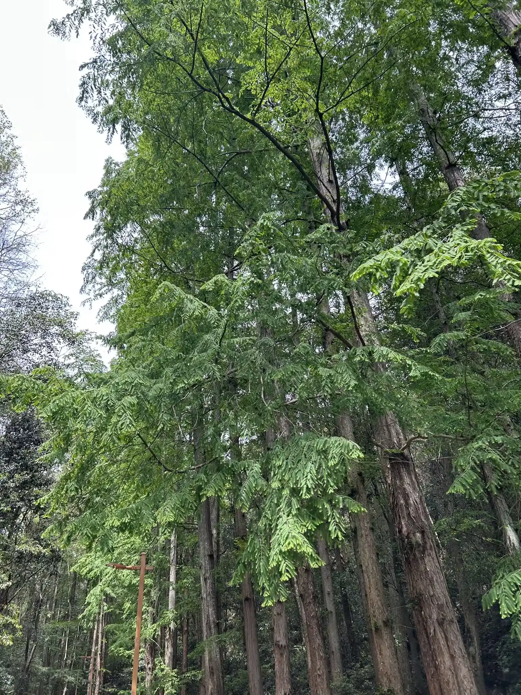

# 杭州三日旅行 2026年5月1日

## 5月2日

5月2日中午抵达杭州东站，同学兼好基友 mx 来接我。他目前在北航杭州校区读研究生，杭州旅行期间借宿他姐姐家。

5月2日傍晚，去*杭州西溪湿地*徒步，傍晚去西溪湿地旁的*山姆超市*，购买了烤牛排和甜点。

## 5月3日，老和山

上午去浙大玉泉校区，从玉泉校区内幽径登上*老和山*，然后一路走到*马家坞观景台*。沿途始终能远眺西湖，风景优美。

*上图：老和山风景，楼房是浙大玉泉校区宿舍，远处是西湖，能看到苏堤*。

## 5月3日，西湖

下午我独自去西湖逛了一圈。从凤起路地铁站下，走过武林夜市，进入西湖风景区东北角。入口人多，非常拥挤。

我沿着北边走过白堤，走了一半苏堤后，从*曲院风荷*处出口离开。下午有些阴天，傍晚放晴，并且苏堤两岸的行人也很少了。坐在岸边，远处游船往来，湖水波光粼粼，杨柳随风浮动，感觉放松和治愈。

*上图：苏提春晓*

*上图：断桥残雪*

*上图：苏提两岸，远眺雷峰塔*

晚上 mx 姐姐请我们吃了一顿烧烤，很好吃。

## 5月4日，龙井茶村

坐地铁到黄龙洞，然后打车进入西湖风景区，一路开到龙井村。我们沿着山路走到九溪十八涧，然后从杨梅岭坐公交车返回。
山路两旁都是梯田式茶园，以及参天古树，美不胜收。

*上图：龙井村出村小道，人与自然的和谐感*

*上图：九溪十八涧*

*上图：杨梅岭，两侧皆为合抱古树*

高铁上车之前，在西湖旁边（龙翔桥地铁站）再次惆怅了一会，然后转头归京上班。

## 总花费

共计 1935.3 CNY
* 交通费 1131 CNY 
* 吃喝杂费 804.3 CNY

感谢 mx 的接待和帮助，下次再见啦。
